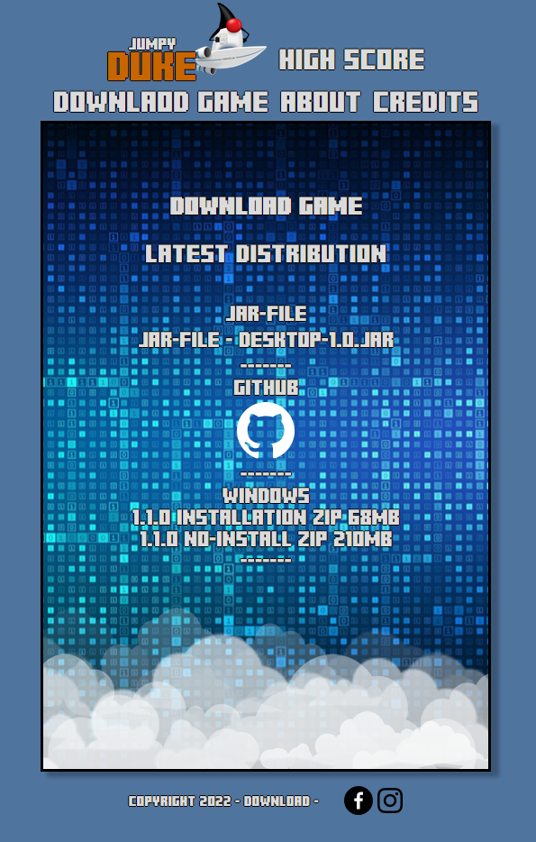

# Jumpy Duke The Game!Cancel changes
                                                                                              https://jumpyduke.com/

## Description

### What?

An interactive platform game inspired by Flappy Bird.
You fly around with Java's own Duke and try to catch bugs and avoid obstacles.
Simple but elegant. The space key is almost the only one you need to keep an eye on.

In the game you get points, which are saved online in a MySQL database connected to the game and the website
through a NodeJS-Express routing application.

The application and the website can be found at this repository:

https://github.com/MagLilja/Jumpy-Duke-Website

### Why?

This project was made as an assignment for a course in Agile Software Development.

We were given the task of creating a game in the style of Flappy Bird and work according to Scrum methods.

The goal was to practice planning, structure and cooperation and to 
hopefully get a taste of what it's like in a real commercial project.

## Dependencies and Components

The game is written in Java 11 with the OpenGL (ES) game development framework [LibGDX](https://libgdx.com/). 

The build tool used is Gradle. 

## Building and running with Gradle

If you do not have gradle installed on your system you can clone 
this repository and build with the Gradle Wrapper. 
```
./gradlew build.
```

To run the program run the following command:

Clone this repository and build with the Gradle Wrapper
```
./gradlew build.
```

## Building a distribution jar

To build a runnable jar file run the following command:

Clone this repository and build with the Gradle Wrapper
```
./gradle dist
```

## Installing

### Windows/exe

* The game can be downloaded as an installable exe-file on the [website](https://jumpyduke.com/download.html)

### Creating exe installer with JPackage

- Activate .Net Framework 3.5
- Install [WiX Toolset](https://wixtoolset.org/)
- Put jar file in a folder 
- Run the following command on the same folder 
```
$ jpackage --input . --dest output --name jumpyDuke --main-jar desktop-1.0.jar --main-class se.yrgo.jumpyduke.desktop.DesktopLauncher --type exe 
```

## Screenshots

### Game


### Website



## Other tools and acknowledgments 

- IntelliJ for being an awsome IDE.
- Insomnia for doing our http requests. 
- Jenkins for CD
- GIT/GITHUB for CI

## Class diagram


## Authors

Contributors names and contact info

Magnus Lilja
Wilhelm Junger
Rayan Sabah

